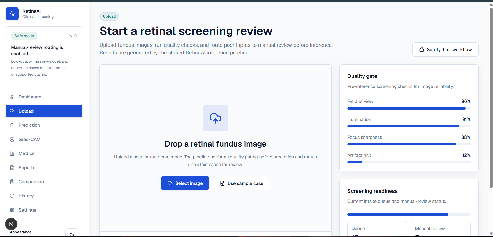

# RetinaAI

RetinaAI is an uncertainty-aware retinal screening platform for diabetic retinopathy severity grading. It combines image quality gating, transfer-learning CNN support, Grad-CAM explainability, uncertainty routing, FastAPI inference, a professional Next.js dashboard, and hospital-style PDF reports.

This is a screening prototype, not a diagnostic medical device. A qualified medical professional must review every output before care decisions.

## Architecture

```text
Retinal image upload
  -> preprocessing.crop_black_borders / resize
  -> quality_check.assess_quality
  -> CNN prediction: EfficientNet-B0, EfficientNet-B3, or ResNet50
  -> fallback baseline: sklearn RandomForest if CNN artifact is missing
  -> uncertainty: confidence, predictive entropy, top-2 margin
  -> Grad-CAM overlay for CNNs, explicit unavailable image for fallback
  -> recommendation and manual-review routing
  -> PDF report
  -> FastAPI + Next.js dashboard
```

## Folder Structure

```text
app/                    Streamlit compatibility app
configs/                Training and threshold configuration
data/                   Raw/external dataset placeholders
src/                    ML, inference, API, report, and validation modules
frontend/               Next.js TypeScript dashboard
tests/                  Pytest coverage and self-checks
reports/                Generated metrics, figures, PDFs
models/                 Local model artifacts, ignored by default
.github/workflows/      CI
```

## Setup

```powershell
python -m venv .venv
.\.venv\Scripts\activate
pip install -r requirements.txt -r requirements-dev.txt
```

Optional CNN training stack:

```powershell
pip install -r requirements-deep-learning.txt
```

Frontend:

```powershell
cd frontend
npm install
```

## Dataset Setup

Supported dataset names: `aptos`, `aptos2019`, `eyepacs`, `messidor`, `idrid`.

The loader is configurable and expects a CSV with an image id column and label column. Built-in column candidates cover common layouts, and custom label mappings can be passed for external validation.

APTOS example:

```text
data/raw/aptos2019/
|-- train.csv
`-- images_288_scaled/
```

Download helper:

```powershell
.\scripts\download_training_data.ps1
```

## Training

Baseline random forest:

```powershell
python -m src.train --model baseline_sklearn --labels-csv data/raw/aptos2019/train.csv --image-dir data/raw/aptos2019/images_288_scaled
```

Transfer learning:

```powershell
python -m src.train --model efficientnet_b0 --labels-csv data/raw/aptos2019/train.csv --image-dir data/raw/aptos2019/images_288_scaled
python -m src.train --model efficientnet_b3 --labels-csv data/raw/aptos2019/train.csv --image-dir data/raw/aptos2019/images_288_scaled
python -m src.train --model resnet50 --labels-csv data/raw/aptos2019/train.csv --image-dir data/raw/aptos2019/images_288_scaled
```

CNN training supports checkpoints, early stopping, mixed precision, learning-rate reduction, class weighting, and reproducible seeds through `configs/train.yaml`.

## Evaluation

Model comparison:

```powershell
python -m src.model_comparison --labels-csv data/raw/aptos2019/train.csv --image-dir data/raw/aptos2019/images_288_scaled --models baseline_sklearn,efficientnet_b0,efficientnet_b3,resnet50
```

Outputs:

- `reports/comparison.csv`
- `reports/comparison.json`
- `reports/comparison.png`
- `reports/figures/model_comparison.png`
- `reports/figures/confusion_matrix_best_model.png`

External validation:

```powershell
python -m src.external_validation --dataset messidor --model models/efficientnet_b0.keras --labels-csv data/external/messidor/labels.csv --image-dir data/external/messidor/images --label-map '{"0":0,"1":1,"2":2,"3":4}'
```

## Inference

CLI:

```powershell
python -m src.inference --image tests/_self_check/synthetic_retina.png --model models/efficientnet_b0.keras --fallback-model models/baseline_sklearn.pkl
```

If the CNN is missing, inference does not crash. It falls back to the random-forest baseline when available, routes uncertain cases to manual review, creates an explicit Grad-CAM-unavailable image, and still generates a PDF report.

## API

Start FastAPI:

```powershell
uvicorn src.api:app --host 127.0.0.1 --port 8000
```

Endpoints:

- `GET /health`
- `POST /predict`
- `POST /quality`
- `POST /gradcam`
- `POST /report`
- `GET /metrics`
- `GET /models`

OpenAPI docs: `http://127.0.0.1:8000/docs`.

## Frontend

```powershell
cd frontend
$env:RETINAAI_API_URL="http://127.0.0.1:8000"
npm run dev -- --hostname 127.0.0.1 --port 3000
```

Pages: Dashboard, Upload, Prediction, Grad-CAM Viewer, Metrics, Reports, Settings, Model Comparison, History.

## Docker

Backend only:

```powershell
docker build -t retinaai-api .
docker run --rm -p 8000:8000 retinaai-api
```

Full stack:

```powershell
docker compose up --build
```

Frontend: `http://127.0.0.1:3000`  API: `http://127.0.0.1:8000`.

## Testing

```powershell
python tests/self_check.py
python -m pytest
python -m py_compile app/streamlit_app.py src/*.py tests/*.py
cd frontend
npm run lint
npm run typecheck
npm run build
npm run test:e2e
```

## Screenshots



Add other current screenshots under `docs/screenshots/` after running the app:

- `docs/screenshots/dashboard.png`
- `docs/screenshots/gradcam.png`
- `docs/screenshots/report.png`

## Results

The repository contains generated baseline comparison artifacts from earlier runs. Regenerate all current metrics with `python -m src.model_comparison` before reporting numbers. Do not publish metrics that were not produced by the pipeline.

## Limitations

- No CNN checkpoint is committed; train one locally with TensorFlow before claiming CNN performance.
- Grad-CAM is real only for trained CNN artifacts. Baseline fallback produces an explicit unavailable explanation image.
- Quality gating is heuristic and should be calibrated on target camera hardware.
- External validation depends on dataset-specific label mapping and access/license constraints.
- Browser history is local-only; production audit logging should persist server-side.

## Future Work

- Add calibration curves and threshold tuning per deployment site.
- Add server-side case history storage and role-based access controls.
- Validate on EyePACS, Messidor, and IDRiD with documented mappings.
- Add model card and dataset card artifacts for each trained checkpoint.
- Package screenshots and final metrics after a full CNN training run.

## Resume Bullet

Built an uncertainty-aware retinal screening platform using EfficientNet/ResNet transfer learning support, image quality gates, Grad-CAM explainability, FastAPI inference, Next.js clinical dashboard, PDF reports, model comparison, external validation hooks, Docker, CI, and automated tests.